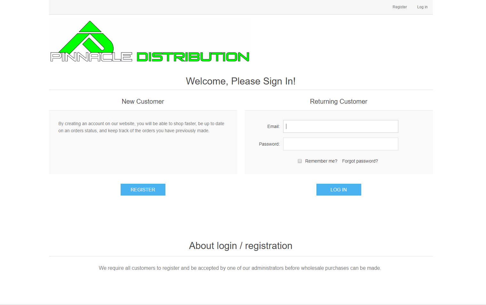
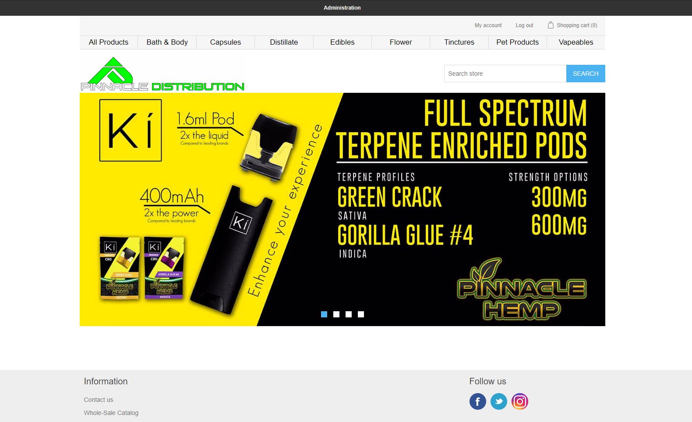
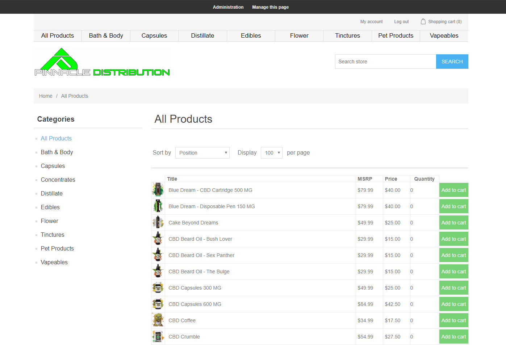
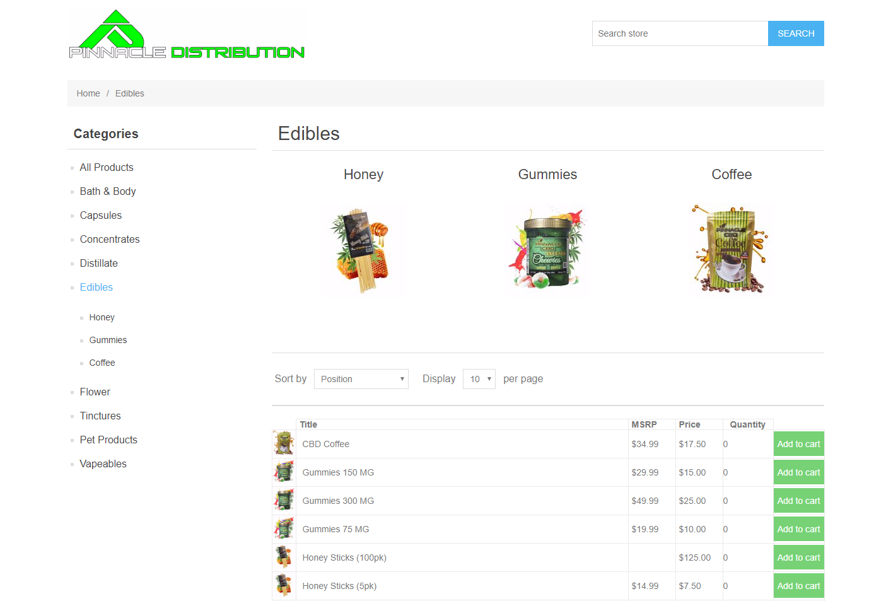
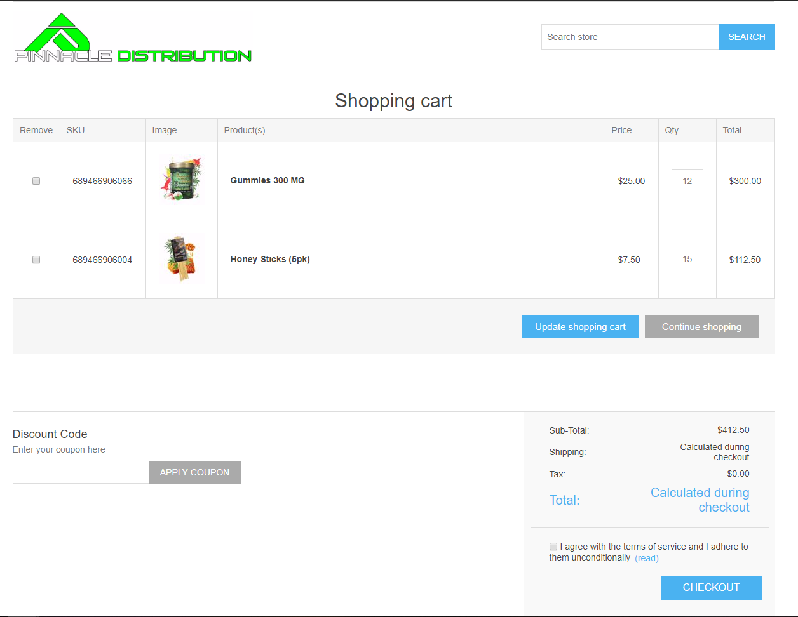
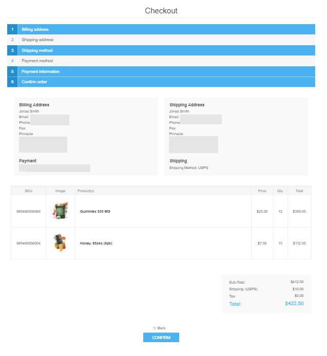

# <a href="https://pinnacledistro.com/"> Pinnacle Distribution </a>
> A E-commerce application for Pinnacle Hemp wholesale customers.  

This application allows for Pinnacle Hemp to have an outlet specific for their wholesale customers. It allowed for more freedom to sales representatives, and better rates for those buying in bulk. I used the open source project <a href="https://github.com/nopSolutions/nopCommerce"> nopCommerce </a> as a good stepping stone on where to get started.

## PinnacleDistro - Views

### Login / Registration

### Storefront

### Store-page

### Store-page category

### Checkout preview

### Login / Registration

## Development setup
> Local installation for nopCommerce Version 4.10

* Build the application
* Run with IIS
* Run through local installation steps
    * Set server name as .`\SQLEXPRESS`
    * Select `Use integrated Windows authentication `
* The E-commerce store is ready to be edited locally now.
* The store you build and start will not look exactly like the photos from above. As much of the photos, products, and information was added through the nopCommerce admin panel and stored to a database.  

## Hosting

* I used Azure to host the web-application as it was easy to integrate and gave me ample tools to monitor the application.

## Issues
> Plenty of issues arose from trying to create an E-commerce application with nopCommerce.
* Because nopCommerce is a little smaller than some other options for open source E-commerce platforms there seems to be a lack of plugins. While for example using Shopify, or even WordPress with woocommerce would allow for someone to easily integrate many useful tools without creating the API connection themselves.
    * For an example, I created a script that runs locally that will create a new <a href="https://www.zendesk.com/sell/"> Zendesk lead </a> for a sales-rep when a new customer registers in pinnacledistro.com ( This project can be located <a href="">HERE</a> ).

## Personal failures
> This was my first commercial application I created, and as a student and the only developer on this project I am still learning a lot about the entire process.

* Know when to give up on a failing idea. I, from scratch, began creating a .Net application that would have worked as an extremely basic E-commerce platform. However it would have been useless to the team working at pinnaclehemp as I had hard coded many, if not, most of the information and products. Luckily, I had noticed early on this would have been a failure so I back tracked the idea and began researching E-commerce applications.
* I needed a better understanding of my own limits. Some days I would spend far too much time working on a problem and as I hit the 4-5 hour marks on one problem my programming became noticeably bad. To the point where I would end up having to redo it or restructure it the next time I felt fresh.
* It is okay to say No.
